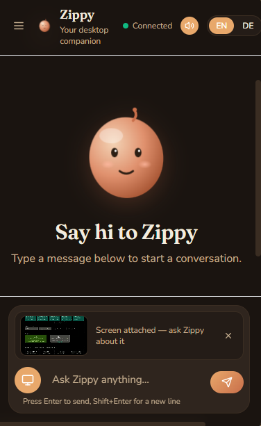
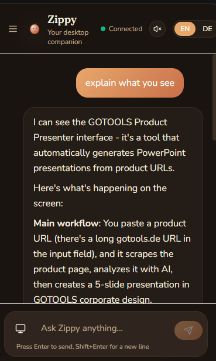

# Zippy

> An AI teacher that lives as a buddy next to your cursor — sees your screen, talks to you, points at stuff.

Zippy is a modern-day [Clippy](https://en.wikipedia.org/wiki/Office_Assistant) —
redesigned for an age where the assistant on your desktop can actually help.
Chat with Claude (or a local Ollama model), with a UI that doesn't feel like
AI slop: warm creams, a terracotta accent, a friendly mascot.

Two pieces:

- **Backend + web UI** — FastAPI + React, packaged as a single Docker container.
  Runs on Linux / ZimaOS, also usable straight in the browser.
- **Desktop overlay (Windows)** — native Tauri window, always-on-top,
  summoned with `Ctrl+Alt+Z` next to your cursor. This is the north star:
  Zippy is not a tab, it's a buddy.


## Status

**Phase 1 — MVP (done, deployed on ZimaOS)**

- [x] Docker single-container deploy, FastAPI + WebSocket streaming
- [x] Anthropic Claude (streaming) and Ollama integration
- [x] React + Tailwind, retro-modern aesthetic, markdown with copy-able code
- [x] Theme toggle (light / dark / system), i18n (EN / DE)
- [x] SQLite conversation persistence + conversation sidebar
- [x] Animated Zippy mascot (idle / thinking / speaking)
- [x] Voice output (browser SpeechSynthesis)
- [x] Voice input (browser SpeechRecognition, Chrome/Edge only)

**Phase 2 — Desktop overlay on Windows**

- [x] Tauri overlay, always-on-top, borderless, draggable header
- [x] Global hotkey `Ctrl+Alt+Z` (show / hide)
- [x] Summon next to the cursor (with monitor-bounds clamp)
- [x] DevTools enabled (`F12`) for in-place debugging
- [x] Screen capture → Claude Vision (native `xcap`, end-to-end verified 2026-04-20)
- [ ] System-tray icon + autostart
- [ ] Pointing prototype (arrows / rings on screen coordinates)
- [ ] Server-side Whisper STT (to fix iPad / Safari gap)

## Quick start (Docker)

```bash
cp .env.example .env
# Edit .env and set ANTHROPIC_API_KEY=sk-ant-...

docker compose up --build
```

Open http://localhost:7860

## Local dev

Two terminals — backend on :7860, frontend dev server on :5173 (proxies API + WS
to the backend).

```bash
# Terminal 1 — backend
cd backend
python -m venv .venv && source .venv/bin/activate
pip install -r requirements.txt
cd ..
DATA_DIR=./data SOUL_FILE=./SOUL.md uvicorn backend.main:app --reload --port 7860

# Terminal 2 — frontend
cd frontend
npm install
npm run dev
```

Open http://localhost:5173

## Desktop overlay (Windows)

The overlay is a thin Tauri wrapper around the web UI — a native always-on-top
window, summoned with `Ctrl+Alt+Z`, that loads whatever backend you point it at
(set the URL in `desktop/src-tauri/tauri.conf.json`).





**Prerequisites on Windows 10/11:**

1. **Rust** — `rustup-init.exe` from https://rustup.rs (stable, MSVC toolchain)
2. **Visual Studio Build Tools** with the "Desktop development with C++" workload
3. **WebView2 Runtime** — pre-installed on modern Windows; otherwise get the
   Evergreen runtime from Microsoft
4. **Tauri CLI** — `npm install -g @tauri-apps/cli@^2` (installs the `tauri` binary on PATH)

Then from the repo root on Windows — **use PowerShell, not `cmd.exe`**
(`cmd` doesn't switch drives with a plain `cd`, which is a common trip-up):

```powershell
cd F:\dev\zippy\desktop\src-tauri
tauri dev
```

(The Tauri CLI walks up through parent directories looking for
`tauri.conf.json`, so you have to launch from `desktop\src-tauri`, not
`desktop`. If you insist on `cmd.exe`, use `cd /d F:\dev\zippy\desktop\src-tauri`.)

The backend must be reachable from the machine running the overlay —
point the overlay at it by editing `devUrl` in
`desktop/src-tauri/tauri.conf.json`.

Full details, Linux/Mac notes, and troubleshooting in
[`desktop/README.md`](desktop/README.md).

## Configuration

All settings live in `.env` (see `.env.example`):

| Variable | Default | Notes |
|---|---|---|
| `ANTHROPIC_API_KEY` | — | Required for Claude |
| `OLLAMA_BASE_URL` | `http://host.docker.internal:11434` | For local models |
| `DEFAULT_PROVIDER` | `anthropic` | `anthropic` or `ollama` |
| `DEFAULT_MODEL` | `claude-sonnet-4-20250514` | |
| `PORT` | `7860` | |

## SOUL.md

Zippy's personality lives in `SOUL.md` at the repo root. It's mounted read-only
into the container at `/data/SOUL.md` and used as the system prompt. Edit it
to give Zippy a different voice.

## Architecture

```
┌──────────────────────────────────────────────┐
│              Docker Container                 │
├──────────────────────────────────────────────┤
│  Vite build → static files served by FastAPI │
│                                              │
│  Browser ─WS─► FastAPI ─► Provider Router    │
│                              ├─ Anthropic    │
│                              └─ Ollama       │
│                                              │
│  SQLite conversations at /data/zippy.sqlite  │
└──────────────────────────────────────────────┘
```

Backend routes:

- `GET /` — SPA (index.html)
- `WS /ws` — streaming chat
- `GET /api/status` — provider health
- `GET /api/providers` — available providers & models
- `GET /api/conversations` — list
- `GET /api/conversations/{id}` — detail
- `PATCH /api/conversations/{id}` — rename
- `DELETE /api/conversations/{id}` — delete

## ZimaOS

Data volume lives at `./data` relative to the compose file.
The container runs entirely self-contained — no host `apt` dependencies.

## License

MIT
